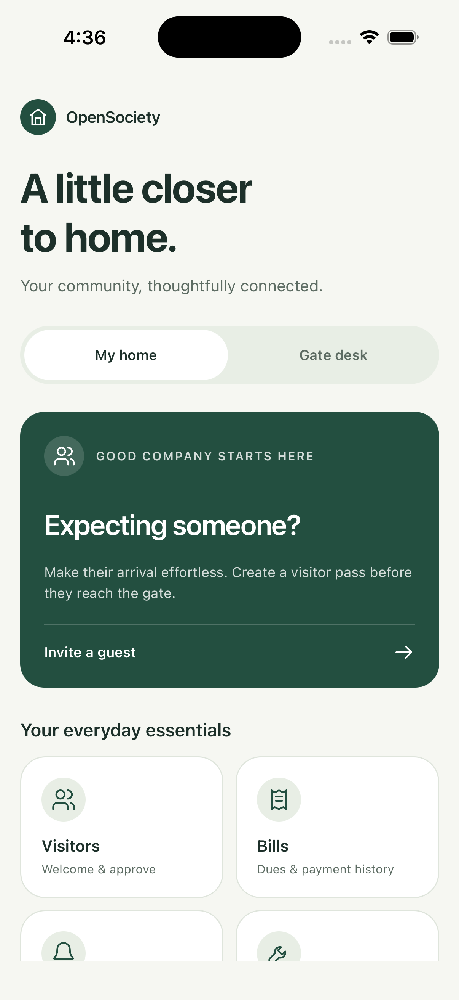
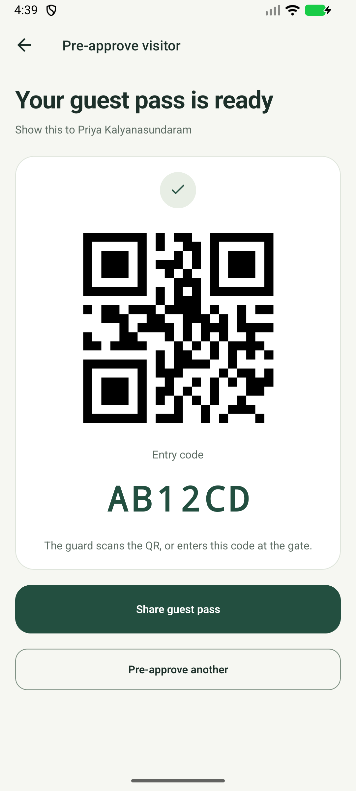
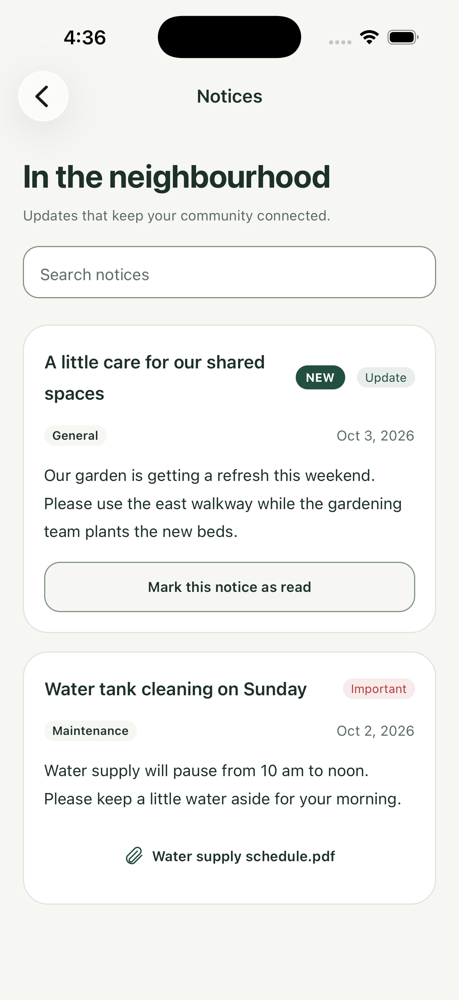
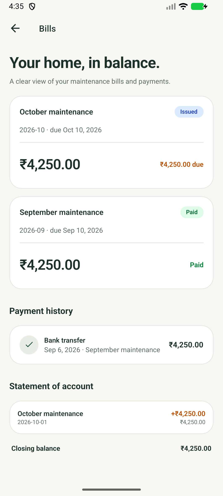
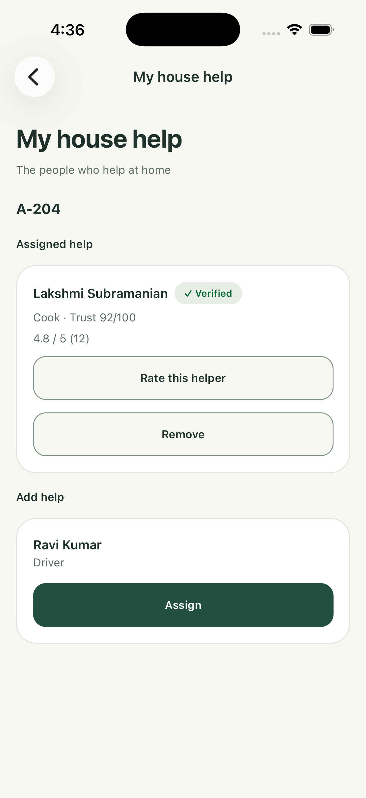
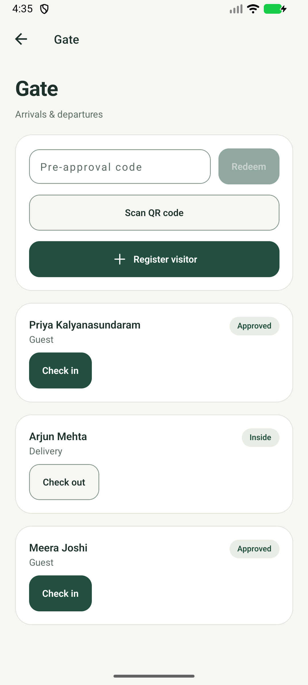

# OpenSociety

**A little closer to home.**

OpenSociety is an ad-free, open-source app for apartment communities. Welcome guests, keep up with neighbourhood notices, track maintenance bills, and take care of everyday requests from one calm, thoughtfully designed place.

Residents and gate staff use the iPhone and Android app. Community administrators manage the society from a web dashboard. Each society runs its own API and database, keeping its records separate and its deployment under its control.

[Explore the app](#a-look-inside) · [Availability](#availability) · [Run locally](#run-locally) · [Deployment guide](deploy/README.md) · [Contribute](#contributing)

## A look inside

These are actual native app captures from iPhone and Android simulators, using fictional demo data. Select an image to see the full-size screen.

<p>
  <a href="docs/screenshots/ios-home.png"></a>
  <a href="docs/screenshots/android-guest-pass.png"></a>
  <a href="docs/screenshots/ios-notices.png"></a>
</p>

*Resident home (iPhone) · Guest pass (Android) · Notices (iPhone)*

A clear view of bills and payments, the people who help at home, and arrivals at the gate.

<p>
  <a href="docs/screenshots/android-bills.png"></a>
  <a href="docs/screenshots/ios-house-help.png"></a>
  <a href="docs/screenshots/android-gate.png"></a>
</p>

*Bills (Android) · Household help (iPhone) · Gate desk (Android)*

## Everyday community life

| For | What you can do |
| --- | --- |
| **Residents** | Pre-approve guests and share QR passes, approve or deny visitors, read notices, view bills and payment history, raise maintenance tickets, and manage household help and vehicles. |
| **Gate staff** | Register visitors, scan passes or enter codes, check people in and out, verify vehicles, and record duty attendance. Visitor registration can queue while offline. |
| **Administrators** | Manage apartments and resident approvals, gate staff, notices, billing, expenses, maintenance tickets, parking, and reports from the web dashboard. |

The mobile app supports English and Hindi, system text scaling, and layouts for smaller screens. Additional regional languages are deferred.

## Availability

**OpenSociety is preparing for its first pilot.** The mobile design is implemented and reviewed on iPhone and Android simulators. Public hosting and App Store / Google Play distribution are still pending, along with physical-device, screen-reader, and live-service acceptance checks.

You can explore the code and run a development instance today. A society deployment needs its own database, authentication configuration, storage, and hosting; running those services can incur costs. Start with the [deployment guide](deploy/README.md) and [mobile release guide](docs/mobile.md) when preparing a pilot.

## Run locally

Use **Node 22** and **pnpm 10.0.0**. The pnpm version is pinned in `package.json`. Development uses pnpm workspaces and Turborepo; no local Docker setup is required.

```sh
git clone https://github.com/opencore-x/opensociety.git
cd opensociety
pnpm install --frozen-lockfile
cp apps/api/.env.example apps/api/.env
cp apps/web/.env.example apps/web/.env
```

Set `DATABASE_URL` in `apps/api/.env` to a development Neon database and configure matching Clerk credentials in the API and web env files. R2 credentials are needed to exercise uploads. The example database URL is a placeholder.

Supply the same development `DATABASE_URL` in your shell before applying the checked-in migrations. The database CLI does not load `apps/api/.env` automatically:

```sh
pnpm --filter @opensociety/db db:migrate
pnpm dev
```

Open **http://localhost:3000/admin**. The Node API runs on **http://localhost:8787**. Turborepo builds shared packages before startup and rebuilds affected workspace dependencies as files change.

For a local demo without Clerk, leave Clerk credentials unset, run `pnpm --filter @opensociety/db db:seed` with the development `DATABASE_URL` in your shell, and set `VITE_DEV_USER_ID=00000000-0000-0000-0000-000000000001` in `apps/web/.env` before starting the app. This seeds a development admin and sample community. Keep development identities and seed data out of deployed environments.

For the Workers adapter, use `pnpm --filter @opensociety/api dev:worker` and keep local secrets in `apps/api/.dev.vars`. The default `pnpm dev` uses the Node adapter and `.env` files.

To run the iPhone or Android app, follow [mobile development](docs/mobile.md#local-development) for API addresses, environment variables, and native builds.

## How it is built

| Part | Stack | Location |
| --- | --- | --- |
| Mobile app | Expo Router, React Native, TanStack Query | [`apps/mobile`](apps/mobile) |
| Admin dashboard | TanStack Start, React, shadcn/ui | [`apps/web`](apps/web) |
| API | Hono on Node 22; Cloudflare Workers adapter also available | [`apps/api`](apps/api) |
| Database | Neon Postgres and Drizzle ORM | [`packages/db`](packages/db) |
| Shared contracts | Zod schemas and translations | [`packages/shared`](packages/shared) |

Clerk authenticates web and mobile sessions; the API maps them to local users and permissions. Each society has a separate API and database with a single society configuration. Cloudflare R2 stores photos and documents, and Expo Push handles mobile notifications. The [deployment guide](deploy/README.md) covers the Node hosting setup, scheduled jobs, migrations, and rollback.

## Contributing

Bug reports, usability feedback, documentation improvements, and focused pull requests are welcome. [Open an issue](https://github.com/opencore-x/opensociety/issues) with the affected flow, expected behaviour, and reproduction steps. For mobile layout issues, include the platform, screen size, and system text size; use fictional data in screenshots.

Before opening a code PR, run the workspace checks:

```sh
pnpm build
pnpm check-types
pnpm lint
pnpm test
```

CI runs these checks and builds and smoke-tests the hosting containers. For mobile UI changes, also review the app on both native platforms; a browser preview alone does not establish native layout quality.

- [Mobile design and component guidance](apps/mobile/components/README.md)
- [Mobile development, builds, and push notifications](docs/mobile.md)
- [Deployment and operations](deploy/README.md)
- [Database schema](packages/db/schema.dbml) and [migrations](packages/db/drizzle)
- [Screenshot provenance and refresh guidance](docs/screenshots/README.md)
